# Face Generation
In this project, you'll use generative adversarial networks to generate new images of faces.
### Get the Data
You'll be using two datasets in this project:
- MNIST
- CelebA

Since the celebA dataset is complex and you're doing GANs in a project for the first time, we want you to test your neural network on MNIST before CelebA.  Running the GANs on MNIST will allow you to see how well your model trains sooner.

If you're using [FloydHub](https://www.floydhub.com/), set `data_dir` to "/input" and use the [FloydHub data ID](http://docs.floydhub.com/home/using_datasets/) "R5KrjnANiKVhLWAkpXhNBe".


```python
data_dir = './data'

# FloydHub - Use with data ID "R5KrjnANiKVhLWAkpXhNBe"
#data_dir = '/input'


"""
DON'T MODIFY ANYTHING IN THIS CELL
"""
import helper

helper.download_extract('mnist', data_dir)
helper.download_extract('celeba', data_dir)
```

    Found mnist Data
    Found celeba Data
    

## Explore the Data
### MNIST
As you're aware, the [MNIST](http://yann.lecun.com/exdb/mnist/) dataset contains images of handwritten digits. You can view the first number of examples by changing `show_n_images`. 


```python
show_n_images = 25

"""
DON'T MODIFY ANYTHING IN THIS CELL
"""
%matplotlib inline
import os
from glob import glob
from matplotlib import pyplot

mnist_images = helper.get_batch(glob(os.path.join(data_dir, 'mnist/*.jpg'))[:show_n_images], 28, 28, 'L')
pyplot.imshow(helper.images_square_grid(mnist_images, 'L'), cmap='gray')
```


    <matplotlib.image.AxesImage at 0x7f5bf845aa90>


### CelebA
The [CelebFaces Attributes Dataset (CelebA)](http://mmlab.ie.cuhk.edu.hk/projects/CelebA.html) dataset contains over 200,000 celebrity images with annotations.  Since you're going to be generating faces, you won't need the annotations.  You can view the first number of examples by changing `show_n_images`.


```python
show_n_images = 25

"""
DON'T MODIFY ANYTHING IN THIS CELL
"""
mnist_images = helper.get_batch(glob(os.path.join(data_dir, 'img_align_celeba/*.jpg'))[:show_n_images], 28, 28, 'RGB')
pyplot.imshow(helper.images_square_grid(mnist_images, 'RGB'))
```


    <matplotlib.image.AxesImage at 0x7f5bf84076a0>


## Preprocess the Data
Since the project's main focus is on building the GANs, we'll preprocess the data for you.  The values of the MNIST and CelebA dataset will be in the range of -0.5 to 0.5 of 28x28 dimensional images.  The CelebA images will be cropped to remove parts of the image that don't include a face, then resized down to 28x28.

The MNIST images are black and white images with a single [color channel](https://en.wikipedia.org/wiki/Channel_(digital_image%29) while the CelebA images have [3 color channels (RGB color channel)](https://en.wikipedia.org/wiki/Channel_(digital_image%29#RGB_Images).
## Build the Neural Network
You'll build the components necessary to build a GANs by implementing the following functions below:
- `model_inputs`
- `discriminator`
- `generator`
- `model_loss`
- `model_opt`
- `train`

### Check the Version of TensorFlow and Access to GPU
This will check to make sure you have the correct version of TensorFlow and access to a GPU


```python
"""
DON'T MODIFY ANYTHING IN THIS CELL
"""
from distutils.version import LooseVersion
import warnings
import tensorflow as tf

# Check TensorFlow Version
assert LooseVersion(tf.__version__) >= LooseVersion('1.0'), 'Please use TensorFlow version 1.0 or newer.  You are using {}'.format(tf.__version__)
print('TensorFlow Version: {}'.format(tf.__version__))

# Check for a GPU
if not tf.test.gpu_device_name():
    warnings.warn('No GPU found. Please use a GPU to train your neural network.')
else:
    print('Default GPU Device: {}'.format(tf.test.gpu_device_name()))
```

    TensorFlow Version: 1.0.0
    Default GPU Device: /gpu:0
    

### Input
Implement the `model_inputs` function to create TF Placeholders for the Neural Network. It should create the following placeholders:
- Real input images placeholder with rank 4 using `image_width`, `image_height`, and `image_channels`.
- Z input placeholder with rank 2 using `z_dim`.
- Learning rate placeholder with rank 0.

Return the placeholders in the following the tuple (tensor of real input images, tensor of z data)


```python
import problem_unittests as tests

def model_inputs(image_width, image_height, image_channels, z_dim):
    """
    Create the model inputs
    :param image_width: The input image width
    :param image_height: The input image height
    :param image_channels: The number of image channels
    :param z_dim: The dimension of Z
    :return: Tuple of (tensor of real input images, tensor of z data, learning rate)
    """
    # TODO: Implement Function
    
    input_real = tf.placeholder(tf.float32, (None, image_width, image_height, image_channels), name='input_real')
    input_z = tf.placeholder(tf.float32, (None, z_dim), name='input_z')
    learning_rate = tf.placeholder(tf.float32)
    
    return input_real, input_z, learning_rate


"""
DON'T MODIFY ANYTHING IN THIS CELL THAT IS BELOW THIS LINE
"""
tests.test_model_inputs(model_inputs)
```

    Tests Passed
    

### Discriminator
Implement `discriminator` to create a discriminator neural network that discriminates on `images`.  This function should be able to reuse the variabes in the neural network.  Use [`tf.variable_scope`](https://www.tensorflow.org/api_docs/python/tf/variable_scope) with a scope name of "discriminator" to allow the variables to be reused.  The function should return a tuple of (tensor output of the generator, tensor logits of the generator).


```python
def discriminator(images, reuse=False):
    """
    Create the discriminator network
    :param image: Tensor of input image(s)
    :param reuse: Boolean if the weights should be reused
    :return: Tuple of (tensor output of the discriminator, tensor logits of the discriminator)
    """
    # TODO: Implement Function

    with tf.variable_scope('discriminator', reuse=reuse):
        # Input layer is 28x28x3
        x1 = tf.layers.conv2d(images, 56, 5, strides=2, padding='same')
        relu1 = tf.maximum(0.2 * x1, x1)
        # 14x14x56

        x2 = tf.layers.conv2d(relu1, 112, 5, strides=2, padding='same')
        bn2 = tf.layers.batch_normalization(x2, training=True)
        relu2 = tf.maximum(0.2 * bn2, bn2)
        # 7x7x112

        # Flatten it
        flat = tf.reshape(relu2, (-1, 7*7*112))
        logits = tf.layers.dense(flat, 1)
        out = tf.sigmoid(logits)

        return out, logits


"""
DON'T MODIFY ANYTHING IN THIS CELL THAT IS BELOW THIS LINE
"""
tests.test_discriminator(discriminator, tf)
```

    Tests Passed
    

### Generator
Implement `generator` to generate an image using `z`. This function should be able to reuse the variabes in the neural network.  Use [`tf.variable_scope`](https://www.tensorflow.org/api_docs/python/tf/variable_scope) with a scope name of "generator" to allow the variables to be reused. The function should return the generated 28 x 28 x `out_channel_dim` images.


```python
def generator(z, out_channel_dim, is_train=True):
    """
    Create the generator network
    :param z: Input z
    :param out_channel_dim: The number of channels in the output image
    :param is_train: Boolean if generator is being used for training
    :return: The tensor output of the generator
    """
    # TODO: Implement Function
    
    with tf.variable_scope("generator", reuse=not is_train) as scope:
        # Fully connected
        fc1 = tf.layers.dense(z, 7*7*256)

        # Reshape
        x1 = tf.reshape(fc1, (-1, 7, 7, 256))
        x1 = tf.layers.batch_normalization(x1, training=True)
        x1 = tf.nn.relu(x1)

        # Second layer 
        x2 = tf.layers.conv2d_transpose(x1, 128, 5, strides=2, padding='SAME')
        x2 = tf.layers.batch_normalization(x2, training=is_train)
        x2 = tf.nn.relu(x2)

        # Ouput layer
        logits = tf.layers.conv2d_transpose(x2, out_channel_dim, 5, strides=2, padding='SAME')
        out = tf.tanh(logits)

    return out


"""
DON'T MODIFY ANYTHING IN THIS CELL THAT IS BELOW THIS LINE
"""
tests.test_generator(generator, tf)
```

    Tests Passed
    

### Loss
Implement `model_loss` to build the GANs for training and calculate the loss.  The function should return a tuple of (discriminator loss, generator loss).  Use the following functions you implemented:
- `discriminator(images, reuse=False)`
- `generator(z, out_channel_dim, is_train=True)`


```python
def model_loss(input_real, input_z, out_channel_dim):
    """
    Get the loss for the discriminator and generator
    :param input_real: Images from the real dataset
    :param input_z: Z input
    :param out_channel_dim: The number of channels in the output image
    :return: A tuple of (discriminator loss, generator loss)
    """
    # TODO: Implement Function
    
    g_model = generator(input_z, out_channel_dim, is_train=True)
    d_model_real, d_logits_real = discriminator(input_real, reuse=False)
    d_model_fake, d_logits_fake = discriminator(g_model, reuse=True)

    d_loss_real = tf.reduce_mean(
        tf.nn.sigmoid_cross_entropy_with_logits(logits=d_logits_real, labels=tf.ones_like(d_model_real)))
    d_loss_fake = tf.reduce_mean(
        tf.nn.sigmoid_cross_entropy_with_logits(logits=d_logits_fake, labels=tf.zeros_like(d_model_fake)))
    g_loss = tf.reduce_mean(
        tf.nn.sigmoid_cross_entropy_with_logits(logits=d_logits_fake, labels=tf.ones_like(d_model_fake)))

    d_loss = d_loss_real + d_loss_fake

    return d_loss, g_loss


"""
DON'T MODIFY ANYTHING IN THIS CELL THAT IS BELOW THIS LINE
"""
tests.test_model_loss(model_loss)
```

    Tests Passed
    

### Optimization
Implement `model_opt` to create the optimization operations for the GANs. Use [`tf.trainable_variables`](https://www.tensorflow.org/api_docs/python/tf/trainable_variables) to get all the trainable variables.  Filter the variables with names that are in the discriminator and generator scope names.  The function should return a tuple of (discriminator training operation, generator training operation).


```python
def model_opt(d_loss, g_loss, learning_rate, beta1):
    """
    Get optimization operations
    :param d_loss: Discriminator loss Tensor
    :param g_loss: Generator loss Tensor
    :param learning_rate: Learning Rate Placeholder
    :param beta1: The exponential decay rate for the 1st moment in the optimizer
    :return: A tuple of (discriminator training operation, generator training operation)
    """
    # TODO: Implement Function
    
    # Get weights and bias to update
    t_vars = tf.trainable_variables()
    d_vars = [var for var in t_vars if var.name.startswith('discriminator')]
    g_vars = [var for var in t_vars if var.name.startswith('generator')]

    # Optimize
    with tf.control_dependencies(tf.get_collection(tf.GraphKeys.UPDATE_OPS)):
        d_train_opt = tf.train.AdamOptimizer(learning_rate, beta1=beta1).minimize(d_loss, var_list=d_vars)
        g_train_opt = tf.train.AdamOptimizer(learning_rate, beta1=beta1).minimize(g_loss, var_list=g_vars)

    return d_train_opt, g_train_opt


"""
DON'T MODIFY ANYTHING IN THIS CELL THAT IS BELOW THIS LINE
"""
tests.test_model_opt(model_opt, tf)
```

    Tests Passed
    

## Neural Network Training
### Show Output
Use this function to show the current output of the generator during training. It will help you determine how well the GANs is training.


```python
"""
DON'T MODIFY ANYTHING IN THIS CELL
"""
import numpy as np

def show_generator_output(sess, n_images, input_z, out_channel_dim, image_mode):
    """
    Show example output for the generator
    :param sess: TensorFlow session
    :param n_images: Number of Images to display
    :param input_z: Input Z Tensor
    :param out_channel_dim: The number of channels in the output image
    :param image_mode: The mode to use for images ("RGB" or "L")
    """
    cmap = None if image_mode == 'RGB' else 'gray'
    z_dim = input_z.get_shape().as_list()[-1]
    example_z = np.random.uniform(-1, 1, size=[n_images, z_dim])

    samples = sess.run(
        generator(input_z, out_channel_dim, False),
        feed_dict={input_z: example_z})

    images_grid = helper.images_square_grid(samples, image_mode)
    pyplot.imshow(images_grid, cmap=cmap)
    pyplot.show()
```

### Train
Implement `train` to build and train the GANs.  Use the following functions you implemented:
- `model_inputs(image_width, image_height, image_channels, z_dim)`
- `model_loss(input_real, input_z, out_channel_dim)`
- `model_opt(d_loss, g_loss, learning_rate, beta1)`

Use the `show_generator_output` to show `generator` output while you train. Running `show_generator_output` for every batch will drastically increase training time and increase the size of the notebook.  It's recommended to print the `generator` output every 100 batches.


```python
def train(epoch_count, batch_size, z_dim, learning_rate, beta1, get_batches, data_shape, data_image_mode):
    """
    Train the GAN
    :param epoch_count: Number of epochs
    :param batch_size: Batch Size
    :param z_dim: Z dimension
    :param learning_rate: Learning Rate
    :param beta1: The exponential decay rate for the 1st moment in the optimizer
    :param get_batches: Function to get batches
    :param data_shape: Shape of the data
    :param data_image_mode: The image mode to use for images ("RGB" or "L")
    """
    # TODO: Build Model
    lr_placeholder = tf.placeholder(tf.float32)
    input_real, input_z, _ = model_inputs(data_shape[1], data_shape[2], data_shape[3], z_dim)
    d_loss, g_loss = model_loss(input_real, input_z, data_shape[3])
    d_opt, g_opt = model_opt(d_loss, g_loss, learning_rate, beta1)
    steps = 0
    with tf.Session() as sess:
        sess.run(tf.global_variables_initializer())
        for epoch_i in range(epoch_count):
            for batch_images in get_batches(batch_size):
                # TODO: Train Model
                steps += 1
            
                batch_z = np.random.uniform(-1, 1, size=(batch_size, z_dim))
                
                _ = sess.run(d_opt, feed_dict={input_real: batch_images, input_z: batch_z})
                #_ = sess.run(g_opt, feed_dict={input_z: batch_z})
                _ = sess.run(g_opt, feed_dict={input_z: batch_z, lr_placeholder: learning_rate, input_real: batch_images})
                if steps % 10 == 0:
                    train_loss_d = d_loss.eval({input_z: batch_z, input_real: batch_images})
                    train_loss_g = g_loss.eval({input_z: batch_z})

                    print("Epoch {}/{}...".format(epoch_i+1, epochs),
                          "Discriminator Loss: {:.4f}...".format(train_loss_d),
                          "Generator Loss: {:.4f}".format(train_loss_g))
                    
                    _ = show_generator_output(sess, 25, input_z, data_shape[3], data_image_mode)
                    
                if steps % 100 == 0:
                    show_generator_output(sess, 25, input_z, data_shape[3], data_image_mode)
```

### MNIST
Test your GANs architecture on MNIST.  After 2 epochs, the GANs should be able to generate images that look like handwritten digits.  Make sure the loss of the generator is lower than the loss of the discriminator or close to 0.


```python
batch_size = 56
z_dim = 56
learning_rate = 0.002
beta1 = 0.001


"""
DON'T MODIFY ANYTHING IN THIS CELL THAT IS BELOW THIS LINE
"""
epochs = 2

mnist_dataset = helper.Dataset('mnist', glob(os.path.join(data_dir, 'mnist/*.jpg')))
with tf.Graph().as_default():
    train(epochs, batch_size, z_dim, learning_rate, beta1, mnist_dataset.get_batches,
          mnist_dataset.shape, mnist_dataset.image_mode)
```

    Epoch 1/2... Discriminator Loss: 1.2261... Generator Loss: 14.6240
    


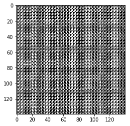


    Epoch 1/2... Discriminator Loss: 0.0112... Generator Loss: 7.9779
    


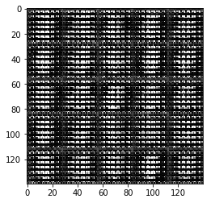


    Epoch 1/2... Discriminator Loss: 2.1599... Generator Loss: 0.2790
    


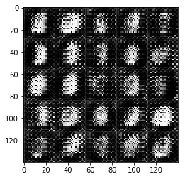


    Epoch 1/2... Discriminator Loss: 1.9341... Generator Loss: 0.2911
    


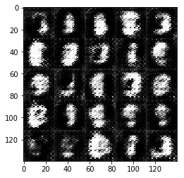


    Epoch 1/2... Discriminator Loss: 1.0604... Generator Loss: 0.5696
    


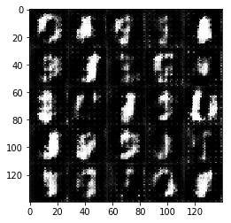


    Epoch 1/2... Discriminator Loss: 0.8654... Generator Loss: 3.1912
    


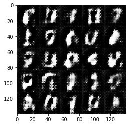


    Epoch 1/2... Discriminator Loss: 2.6598... Generator Loss: 0.0880
    


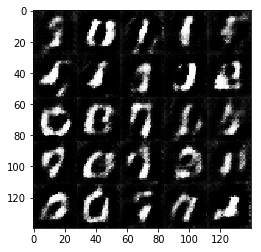


    Epoch 1/2... Discriminator Loss: 0.4305... Generator Loss: 3.0117
    


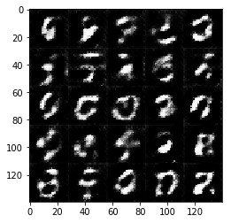


    Epoch 1/2... Discriminator Loss: 1.6471... Generator Loss: 5.0652
    


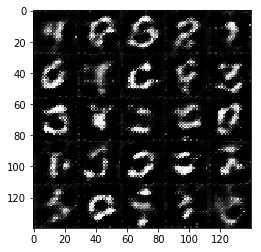


    Epoch 1/2... Discriminator Loss: 0.1650... Generator Loss: 3.2047
    


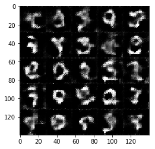


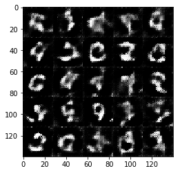


    Epoch 1/2... Discriminator Loss: 2.8900... Generator Loss: 0.0801
    


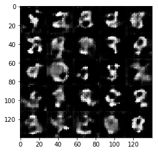


    Epoch 1/2... Discriminator Loss: 0.1838... Generator Loss: 2.7260
    


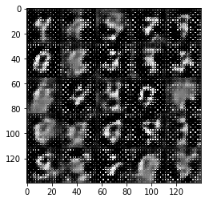


    Epoch 1/2... Discriminator Loss: 0.6277... Generator Loss: 0.9868
    


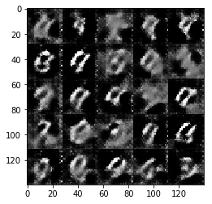


    Epoch 1/2... Discriminator Loss: 0.3015... Generator Loss: 1.8584
    


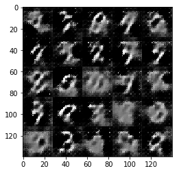


    Epoch 1/2... Discriminator Loss: 0.1050... Generator Loss: 3.3189
    


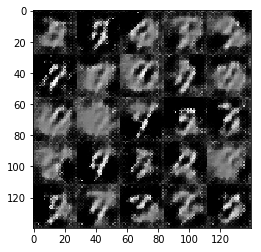


    Epoch 1/2... Discriminator Loss: 3.8892... Generator Loss: 0.0386
    


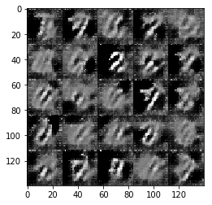


    Epoch 1/2... Discriminator Loss: 2.1428... Generator Loss: 0.1774
    


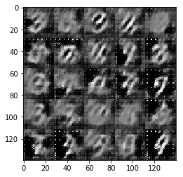


    Epoch 1/2... Discriminator Loss: 1.1135... Generator Loss: 0.5404
    


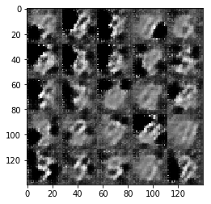


    Epoch 1/2... Discriminator Loss: 2.9776... Generator Loss: 5.5497
    


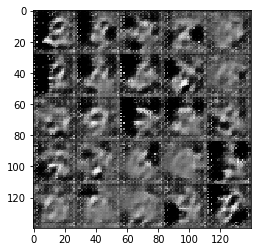


    Epoch 1/2... Discriminator Loss: 0.0329... Generator Loss: 6.0530
    


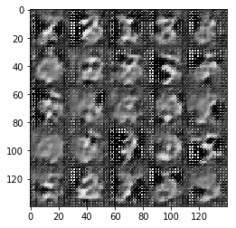


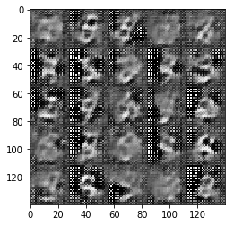


    Epoch 1/2... Discriminator Loss: 0.5494... Generator Loss: 1.2682
    


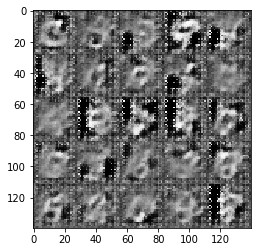


    Epoch 1/2... Discriminator Loss: 0.2906... Generator Loss: 3.9644
    


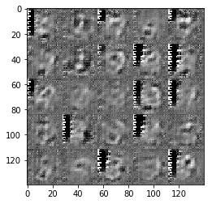


    Epoch 1/2... Discriminator Loss: 0.1338... Generator Loss: 4.5578
    


    Epoch 1/2... Discriminator Loss: 0.4091... Generator Loss: 1.8749
    


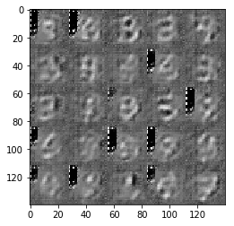


    Epoch 1/2... Discriminator Loss: 0.4011... Generator Loss: 2.1767
    


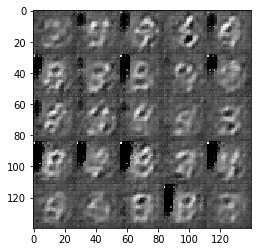


    Epoch 1/2... Discriminator Loss: 0.0606... Generator Loss: 5.6216
    


    Epoch 1/2... Discriminator Loss: 2.8060... Generator Loss: 0.1433
    


    Epoch 1/2... Discriminator Loss: 2.5915... Generator Loss: 0.1005
    


    Epoch 1/2... Discriminator Loss: 2.2427... Generator Loss: 0.1373
    


    Epoch 1/2... Discriminator Loss: 0.8525... Generator Loss: 1.9061
    


    Epoch 1/2... Discriminator Loss: 0.2018... Generator Loss: 3.4076
    


    Epoch 1/2... Discriminator Loss: 0.3527... Generator Loss: 3.7156
    


    Epoch 1/2... Discriminator Loss: 0.1926... Generator Loss: 4.3408
    


    Epoch 1/2... Discriminator Loss: 0.3192... Generator Loss: 5.1486
    


    Epoch 1/2... Discriminator Loss: 7.3557... Generator Loss: 5.8863
    


    Epoch 1/2... Discriminator Loss: 3.7650... Generator Loss: 4.8933
    


    Epoch 1/2... Discriminator Loss: 1.3202... Generator Loss: 1.7784
    


    Epoch 1/2... Discriminator Loss: 0.5123... Generator Loss: 2.8005
    


    Epoch 1/2... Discriminator Loss: 2.2692... Generator Loss: 3.5610
    


    Epoch 1/2... Discriminator Loss: 0.3506... Generator Loss: 2.2483
    


    Epoch 1/2... Discriminator Loss: 1.4111... Generator Loss: 2.9186
    


    Epoch 1/2... Discriminator Loss: 0.7546... Generator Loss: 3.0202
    


    Epoch 1/2... Discriminator Loss: 2.4791... Generator Loss: 2.6285
    


    Epoch 1/2... Discriminator Loss: 0.4697... Generator Loss: 3.1709
    


    Epoch 1/2... Discriminator Loss: 0.3695... Generator Loss: 1.7159
    


    Epoch 1/2... Discriminator Loss: 0.2266... Generator Loss: 3.5390
    


    Epoch 1/2... Discriminator Loss: 1.5838... Generator Loss: 0.3395
    


    Epoch 1/2... Discriminator Loss: 0.6441... Generator Loss: 0.9174
    


    Epoch 1/2... Discriminator Loss: 1.1410... Generator Loss: 0.5188
    


    Epoch 1/2... Discriminator Loss: 0.9330... Generator Loss: 0.6984
    


    Epoch 1/2... Discriminator Loss: 2.1377... Generator Loss: 0.1521
    


    Epoch 1/2... Discriminator Loss: 1.3232... Generator Loss: 2.0784
    


    Epoch 1/2... Discriminator Loss: 0.7933... Generator Loss: 3.0372
    


    Epoch 1/2... Discriminator Loss: 0.4522... Generator Loss: 4.1338
    


    Epoch 1/2... Discriminator Loss: 1.9179... Generator Loss: 1.9984
    


    Epoch 1/2... Discriminator Loss: 0.5655... Generator Loss: 3.4448
    


    Epoch 1/2... Discriminator Loss: 0.3893... Generator Loss: 3.2052
    


    Epoch 1/2... Discriminator Loss: 0.1809... Generator Loss: 3.5390
    


    Epoch 1/2... Discriminator Loss: 0.7167... Generator Loss: 0.8763
    


    Epoch 1/2... Discriminator Loss: 0.2429... Generator Loss: 2.2202
    


    Epoch 1/2... Discriminator Loss: 0.2280... Generator Loss: 2.1145
    


    Epoch 1/2... Discriminator Loss: 1.5149... Generator Loss: 0.9747
    


    Epoch 1/2... Discriminator Loss: 1.5202... Generator Loss: 3.5012
    


    Epoch 1/2... Discriminator Loss: 0.9370... Generator Loss: 2.7142
    


    Epoch 1/2... Discriminator Loss: 1.4916... Generator Loss: 0.3355
    


    Epoch 1/2... Discriminator Loss: 1.3563... Generator Loss: 0.3883
    


    Epoch 1/2... Discriminator Loss: 0.6237... Generator Loss: 3.0932
    


    Epoch 1/2... Discriminator Loss: 0.5379... Generator Loss: 1.1635
    


    Epoch 1/2... Discriminator Loss: 0.1729... Generator Loss: 3.0632
    


    Epoch 1/2... Discriminator Loss: 0.3919... Generator Loss: 5.8485
    


    Epoch 1/2... Discriminator Loss: 0.1606... Generator Loss: 3.2614
    


    Epoch 1/2... Discriminator Loss: 0.7284... Generator Loss: 0.8491
    


    Epoch 1/2... Discriminator Loss: 3.6135... Generator Loss: 0.0376
    


    Epoch 1/2... Discriminator Loss: 0.5273... Generator Loss: 1.1443
    


    Epoch 1/2... Discriminator Loss: 0.1906... Generator Loss: 2.5082
    


    Epoch 1/2... Discriminator Loss: 0.4068... Generator Loss: 4.8177
    


    Epoch 1/2... Discriminator Loss: 0.0571... Generator Loss: 4.1781
    


    Epoch 1/2... Discriminator Loss: 1.2073... Generator Loss: 0.7646
    


    Epoch 1/2... Discriminator Loss: 2.0916... Generator Loss: 3.2694
    


    Epoch 1/2... Discriminator Loss: 0.6891... Generator Loss: 2.3470
    


    Epoch 1/2... Discriminator Loss: 0.6513... Generator Loss: 0.9727
    


    Epoch 1/2... Discriminator Loss: 0.0903... Generator Loss: 3.4215
    


    Epoch 1/2... Discriminator Loss: 0.4779... Generator Loss: 1.4508
    


    Epoch 1/2... Discriminator Loss: 0.1090... Generator Loss: 2.8844
    


    Epoch 1/2... Discriminator Loss: 0.1554... Generator Loss: 3.7850
    


    Epoch 1/2... Discriminator Loss: 1.3210... Generator Loss: 0.4144
    


    Epoch 1/2... Discriminator Loss: 1.9325... Generator Loss: 0.2296
    


    Epoch 1/2... Discriminator Loss: 2.1304... Generator Loss: 0.1672
    


    Epoch 1/2... Discriminator Loss: 1.1927... Generator Loss: 0.4287
    


    Epoch 1/2... Discriminator Loss: 0.4643... Generator Loss: 2.2139
    


    Epoch 1/2... Discriminator Loss: 0.2082... Generator Loss: 4.3159
    


    Epoch 1/2... Discriminator Loss: 0.1291... Generator Loss: 2.9374
    


    Epoch 1/2... Discriminator Loss: 3.0922... Generator Loss: 0.0555
    


    Epoch 1/2... Discriminator Loss: 1.1995... Generator Loss: 0.4049
    


    Epoch 1/2... Discriminator Loss: 0.2082... Generator Loss: 4.4679
    


    Epoch 1/2... Discriminator Loss: 0.8123... Generator Loss: 0.8215
    


    Epoch 1/2... Discriminator Loss: 0.1722... Generator Loss: 2.4955
    


    Epoch 1/2... Discriminator Loss: 0.3916... Generator Loss: 1.4538
    


    Epoch 1/2... Discriminator Loss: 0.0620... Generator Loss: 5.9466
    


    Epoch 1/2... Discriminator Loss: 0.0668... Generator Loss: 4.0754
    


    Epoch 1/2... Discriminator Loss: 0.1631... Generator Loss: 3.2057
    


    Epoch 1/2... Discriminator Loss: 0.0767... Generator Loss: 6.3399
    


    Epoch 1/2... Discriminator Loss: 0.0392... Generator Loss: 4.9570
    


    Epoch 1/2... Discriminator Loss: 0.0542... Generator Loss: 4.1162
    


    Epoch 1/2... Discriminator Loss: 0.6757... Generator Loss: 0.9015
    


    Epoch 1/2... Discriminator Loss: 0.0440... Generator Loss: 4.7718
    


    Epoch 1/2... Discriminator Loss: 2.3119... Generator Loss: 0.1238
    


    Epoch 2/2... Discriminator Loss: 2.4561... Generator Loss: 0.1186
    


    Epoch 2/2... Discriminator Loss: 2.1055... Generator Loss: 0.1550
    


    Epoch 2/2... Discriminator Loss: 0.7172... Generator Loss: 0.8548
    


    Epoch 2/2... Discriminator Loss: 0.1442... Generator Loss: 3.7476
    


    Epoch 2/2... Discriminator Loss: 1.2344... Generator Loss: 0.9512
    


    Epoch 2/2... Discriminator Loss: 1.2582... Generator Loss: 2.8309
    


    Epoch 2/2... Discriminator Loss: 0.5331... Generator Loss: 1.3741
    


    Epoch 2/2... Discriminator Loss: 0.1627... Generator Loss: 2.5947
    


    Epoch 2/2... Discriminator Loss: 0.1854... Generator Loss: 2.3831
    


    Epoch 2/2... Discriminator Loss: 3.5496... Generator Loss: 4.3924
    


    Epoch 2/2... Discriminator Loss: 0.6645... Generator Loss: 2.4294
    


    Epoch 2/2... Discriminator Loss: 2.5362... Generator Loss: 0.1127
    


    Epoch 2/2... Discriminator Loss: 1.7130... Generator Loss: 3.5991
    


    Epoch 2/2... Discriminator Loss: 0.5255... Generator Loss: 1.9622
    


    Epoch 2/2... Discriminator Loss: 0.4688... Generator Loss: 1.5192
    


    Epoch 2/2... Discriminator Loss: 0.1277... Generator Loss: 2.9132
    


    Epoch 2/2... Discriminator Loss: 0.2558... Generator Loss: 2.9062
    


    Epoch 2/2... Discriminator Loss: 1.6762... Generator Loss: 0.2651
    


    Epoch 2/2... Discriminator Loss: 0.4974... Generator Loss: 1.1355
    


    Epoch 2/2... Discriminator Loss: 0.2174... Generator Loss: 2.0616
    


    Epoch 2/2... Discriminator Loss: 0.1032... Generator Loss: 3.0918
    


    Epoch 2/2... Discriminator Loss: 0.0646... Generator Loss: 4.2043
    


    Epoch 2/2... Discriminator Loss: 0.1876... Generator Loss: 3.2429
    


    Epoch 2/2... Discriminator Loss: 0.0405... Generator Loss: 6.1928
    


    Epoch 2/2... Discriminator Loss: 0.0513... Generator Loss: 5.1277
    


    Epoch 2/2... Discriminator Loss: 0.2411... Generator Loss: 1.9368
    


    Epoch 2/2... Discriminator Loss: 0.0315... Generator Loss: 4.7680
    


    Epoch 2/2... Discriminator Loss: 0.0284... Generator Loss: 5.6939
    


    Epoch 2/2... Discriminator Loss: 3.1200... Generator Loss: 0.0775
    


    Epoch 2/2... Discriminator Loss: 1.6197... Generator Loss: 0.2821
    


    Epoch 2/2... Discriminator Loss: 1.5342... Generator Loss: 0.3375
    


    Epoch 2/2... Discriminator Loss: 2.3648... Generator Loss: 0.1353
    


    Epoch 2/2... Discriminator Loss: 1.1282... Generator Loss: 0.5075
    


    Epoch 2/2... Discriminator Loss: 0.2790... Generator Loss: 1.8894
    


    Epoch 2/2... Discriminator Loss: 0.8800... Generator Loss: 3.5650
    


    Epoch 2/2... Discriminator Loss: 1.2440... Generator Loss: 3.0623
    


    Epoch 2/2... Discriminator Loss: 0.3928... Generator Loss: 1.4332
    


    Epoch 2/2... Discriminator Loss: 0.0908... Generator Loss: 3.3215
    


    Epoch 2/2... Discriminator Loss: 0.3973... Generator Loss: 1.4660
    


    Epoch 2/2... Discriminator Loss: 0.1252... Generator Loss: 2.7286
    


    Epoch 2/2... Discriminator Loss: 0.3632... Generator Loss: 1.4507
    


    Epoch 2/2... Discriminator Loss: 0.0691... Generator Loss: 3.5829
    


    Epoch 2/2... Discriminator Loss: 0.1031... Generator Loss: 4.2847
    


    Epoch 2/2... Discriminator Loss: 0.1073... Generator Loss: 3.0223
    


    Epoch 2/2... Discriminator Loss: 0.0548... Generator Loss: 4.0912
    


    Epoch 2/2... Discriminator Loss: 0.0365... Generator Loss: 6.5471
    


    Epoch 2/2... Discriminator Loss: 0.0409... Generator Loss: 5.3347
    


    Epoch 2/2... Discriminator Loss: 4.0909... Generator Loss: 5.0975
    


    Epoch 2/2... Discriminator Loss: 1.2978... Generator Loss: 2.6845
    


    Epoch 2/2... Discriminator Loss: 0.9822... Generator Loss: 2.9978
    


    Epoch 2/2... Discriminator Loss: 0.7066... Generator Loss: 3.7135
    


    Epoch 2/2... Discriminator Loss: 0.5901... Generator Loss: 4.1160
    


    Epoch 2/2... Discriminator Loss: 0.5798... Generator Loss: 4.0398
    


    Epoch 2/2... Discriminator Loss: 1.6264... Generator Loss: 5.4876
    


    Epoch 2/2... Discriminator Loss: 0.4664... Generator Loss: 3.7270
    


    Epoch 2/2... Discriminator Loss: 0.2106... Generator Loss: 3.0926
    


    Epoch 2/2... Discriminator Loss: 0.6523... Generator Loss: 0.9424
    


    Epoch 2/2... Discriminator Loss: 1.5874... Generator Loss: 3.2035
    


    Epoch 2/2... Discriminator Loss: 0.5286... Generator Loss: 4.4705
    


    Epoch 2/2... Discriminator Loss: 0.5577... Generator Loss: 1.4467
    


    Epoch 2/2... Discriminator Loss: 0.7975... Generator Loss: 0.7620
    


    Epoch 2/2... Discriminator Loss: 0.1278... Generator Loss: 2.8273
    


    Epoch 2/2... Discriminator Loss: 0.0823... Generator Loss: 3.7050
    


    Epoch 2/2... Discriminator Loss: 0.1968... Generator Loss: 3.6295
    


    Epoch 2/2... Discriminator Loss: 0.1790... Generator Loss: 4.8742
    


    Epoch 2/2... Discriminator Loss: 1.0800... Generator Loss: 3.6032
    


    Epoch 2/2... Discriminator Loss: 0.6580... Generator Loss: 4.2079
    


    Epoch 2/2... Discriminator Loss: 0.6977... Generator Loss: 2.2375
    


    Epoch 2/2... Discriminator Loss: 0.1166... Generator Loss: 2.9945
    


    Epoch 2/2... Discriminator Loss: 0.5067... Generator Loss: 1.1740
    


    Epoch 2/2... Discriminator Loss: 0.0604... Generator Loss: 4.4699
    


    Epoch 2/2... Discriminator Loss: 0.0402... Generator Loss: 5.1654
    


    Epoch 2/2... Discriminator Loss: 0.0397... Generator Loss: 4.7602
    


    Epoch 2/2... Discriminator Loss: 0.0642... Generator Loss: 6.1633
    


    Epoch 2/2... Discriminator Loss: 0.0312... Generator Loss: 5.2793
    


    Epoch 2/2... Discriminator Loss: 0.0312... Generator Loss: 5.5244
    


    Epoch 2/2... Discriminator Loss: 0.0590... Generator Loss: 3.9297
    


    Epoch 2/2... Discriminator Loss: 2.4096... Generator Loss: 0.1321
    


    Epoch 2/2... Discriminator Loss: 1.4176... Generator Loss: 0.3297
    


    Epoch 2/2... Discriminator Loss: 1.9080... Generator Loss: 0.2012
    


    Epoch 2/2... Discriminator Loss: 0.1960... Generator Loss: 3.6243
    


    Epoch 2/2... Discriminator Loss: 0.1920... Generator Loss: 3.8572
    


    Epoch 2/2... Discriminator Loss: 0.1322... Generator Loss: 3.6270
    


    Epoch 2/2... Discriminator Loss: 0.1661... Generator Loss: 2.4033
    


    Epoch 2/2... Discriminator Loss: 0.1705... Generator Loss: 2.2206
    


    Epoch 2/2... Discriminator Loss: 0.0628... Generator Loss: 6.5685
    


    Epoch 2/2... Discriminator Loss: 0.0443... Generator Loss: 6.1479
    


    Epoch 2/2... Discriminator Loss: 0.0378... Generator Loss: 4.6473
    


    Epoch 2/2... Discriminator Loss: 0.0668... Generator Loss: 3.4329
    


    Epoch 2/2... Discriminator Loss: 0.0394... Generator Loss: 6.9475
    


    Epoch 2/2... Discriminator Loss: 0.1323... Generator Loss: 2.6323
    


    Epoch 2/2... Discriminator Loss: 0.0900... Generator Loss: 6.7955
    


    Epoch 2/2... Discriminator Loss: 0.0991... Generator Loss: 3.0365
    


    Epoch 2/2... Discriminator Loss: 0.0571... Generator Loss: 4.0384
    


    Epoch 2/2... Discriminator Loss: 0.0350... Generator Loss: 4.4516
    


    Epoch 2/2... Discriminator Loss: 0.0548... Generator Loss: 6.8472
    


    Epoch 2/2... Discriminator Loss: 0.0919... Generator Loss: 4.9369
    


    Epoch 2/2... Discriminator Loss: 2.2444... Generator Loss: 0.1674
    


    Epoch 2/2... Discriminator Loss: 1.6615... Generator Loss: 0.3063
    


    Epoch 2/2... Discriminator Loss: 0.3106... Generator Loss: 1.7031
    


    Epoch 2/2... Discriminator Loss: 1.9206... Generator Loss: 0.2391
    


    Epoch 2/2... Discriminator Loss: 1.1986... Generator Loss: 0.4694
    


    Epoch 2/2... Discriminator Loss: 0.2522... Generator Loss: 3.2587
    


    Epoch 2/2... Discriminator Loss: 0.8674... Generator Loss: 1.4216
    


    Epoch 2/2... Discriminator Loss: 1.7080... Generator Loss: 3.9627
    


    Epoch 2/2... Discriminator Loss: 1.6252... Generator Loss: 0.3130
    


    Epoch 2/2... Discriminator Loss: 1.7275... Generator Loss: 0.2618
    


### CelebA
Run your GANs on CelebA.  It will take around 20 minutes on the average GPU to run one epoch.  You can run the whole epoch or stop when it starts to generate realistic faces.


```python
batch_size = 56
z_dim = 56
learning_rate = 0.002
beta1 = 0.001


"""
DON'T MODIFY ANYTHING IN THIS CELL THAT IS BELOW THIS LINE
"""
epochs = 1

celeba_dataset = helper.Dataset('celeba', glob(os.path.join(data_dir, 'img_align_celeba/*.jpg')))
with tf.Graph().as_default():
    train(epochs, batch_size, z_dim, learning_rate, beta1, celeba_dataset.get_batches,
          celeba_dataset.shape, celeba_dataset.image_mode)
```

    Epoch 1/1... Discriminator Loss: 7.1379... Generator Loss: 0.0108
    


    Epoch 1/1... Discriminator Loss: 2.4169... Generator Loss: 10.2369
    


    Epoch 1/1... Discriminator Loss: 1.2249... Generator Loss: 1.1537
    


    Epoch 1/1... Discriminator Loss: 4.7351... Generator Loss: 9.3861
    


    Epoch 1/1... Discriminator Loss: 0.1076... Generator Loss: 4.2833
    


    Epoch 1/1... Discriminator Loss: 0.5722... Generator Loss: 0.9761
    


    Epoch 1/1... Discriminator Loss: 0.0700... Generator Loss: 4.0924
    


    Epoch 1/1... Discriminator Loss: 0.9599... Generator Loss: 0.8709
    


    Epoch 1/1... Discriminator Loss: 0.8792... Generator Loss: 2.5862
    


    Epoch 1/1... Discriminator Loss: 0.3742... Generator Loss: 1.6799
    


    Epoch 1/1... Discriminator Loss: 0.3028... Generator Loss: 1.8224
    


    Epoch 1/1... Discriminator Loss: 1.3584... Generator Loss: 0.5601
    


    Epoch 1/1... Discriminator Loss: 1.4002... Generator Loss: 0.7501
    


    Epoch 1/1... Discriminator Loss: 0.1278... Generator Loss: 3.2307
    


    Epoch 1/1... Discriminator Loss: 0.3087... Generator Loss: 3.8003
    


    Epoch 1/1... Discriminator Loss: 0.4823... Generator Loss: 3.4336
    


    Epoch 1/1... Discriminator Loss: 0.2752... Generator Loss: 3.3997
    


    Epoch 1/1... Discriminator Loss: 1.2219... Generator Loss: 5.0850
    


    Epoch 1/1... Discriminator Loss: 0.5407... Generator Loss: 1.7755
    


    Epoch 1/1... Discriminator Loss: 0.4210... Generator Loss: 2.1057
    


    Epoch 1/1... Discriminator Loss: 0.2535... Generator Loss: 2.2243
    


    Epoch 1/1... Discriminator Loss: 0.5470... Generator Loss: 3.7580
    


    Epoch 1/1... Discriminator Loss: 0.2581... Generator Loss: 4.0780
    


    Epoch 1/1... Discriminator Loss: 3.0883... Generator Loss: 3.9748
    


    Epoch 1/1... Discriminator Loss: 2.0868... Generator Loss: 4.1233
    


    Epoch 1/1... Discriminator Loss: 0.5273... Generator Loss: 1.3650
    


    Epoch 1/1... Discriminator Loss: 0.7212... Generator Loss: 1.2536
    


    Epoch 1/1... Discriminator Loss: 0.5212... Generator Loss: 1.6492
    


    Epoch 1/1... Discriminator Loss: 0.7839... Generator Loss: 1.0615
    


    Epoch 1/1... Discriminator Loss: 2.3296... Generator Loss: 1.4844
    


    Epoch 1/1... Discriminator Loss: 2.2583... Generator Loss: 2.1736
    


    Epoch 1/1... Discriminator Loss: 2.5814... Generator Loss: 2.1216
    


    Epoch 1/1... Discriminator Loss: 1.5433... Generator Loss: 1.4624
    


    Epoch 1/1... Discriminator Loss: 1.4868... Generator Loss: 0.3356
    


    Epoch 1/1... Discriminator Loss: 1.3319... Generator Loss: 1.2925
    


    Epoch 1/1... Discriminator Loss: 2.3025... Generator Loss: 0.1559
    


    Epoch 1/1... Discriminator Loss: 1.6387... Generator Loss: 1.4267
    


    Epoch 1/1... Discriminator Loss: 0.7765... Generator Loss: 1.8763
    


    Epoch 1/1... Discriminator Loss: 1.6221... Generator Loss: 1.0078
    


    Epoch 1/1... Discriminator Loss: 1.2773... Generator Loss: 1.0317
    


    Epoch 1/1... Discriminator Loss: 0.9696... Generator Loss: 1.3942
    


    Epoch 1/1... Discriminator Loss: 1.2051... Generator Loss: 0.5788
    


    Epoch 1/1... Discriminator Loss: 1.5162... Generator Loss: 0.3492
    


    Epoch 1/1... Discriminator Loss: 1.0557... Generator Loss: 1.2959
    


    Epoch 1/1... Discriminator Loss: 1.0046... Generator Loss: 0.6598
    


    Epoch 1/1... Discriminator Loss: 1.0761... Generator Loss: 0.7165
    


    Epoch 1/1... Discriminator Loss: 2.9019... Generator Loss: 1.6352
    


    Epoch 1/1... Discriminator Loss: 1.0642... Generator Loss: 1.4679
    


    Epoch 1/1... Discriminator Loss: 2.0849... Generator Loss: 0.1711
    


    Epoch 1/1... Discriminator Loss: 1.8053... Generator Loss: 0.2642
    


    Epoch 1/1... Discriminator Loss: 2.3625... Generator Loss: 2.7324
    


    Epoch 1/1... Discriminator Loss: 1.9223... Generator Loss: 2.1565
    


    Epoch 1/1... Discriminator Loss: 1.0086... Generator Loss: 1.0449
    


    Epoch 1/1... Discriminator Loss: 1.0786... Generator Loss: 0.6500
    


    Epoch 1/1... Discriminator Loss: 2.1309... Generator Loss: 0.1628
    


    Epoch 1/1... Discriminator Loss: 1.0772... Generator Loss: 0.5990
    


    Epoch 1/1... Discriminator Loss: 1.2657... Generator Loss: 0.4475
    


    Epoch 1/1... Discriminator Loss: 1.3027... Generator Loss: 0.4583
    


    Epoch 1/1... Discriminator Loss: 1.4231... Generator Loss: 0.3986
    


    Epoch 1/1... Discriminator Loss: 1.2910... Generator Loss: 0.7982
    


    Epoch 1/1... Discriminator Loss: 1.2961... Generator Loss: 0.4132
    


    Epoch 1/1... Discriminator Loss: 1.0774... Generator Loss: 0.8293
    


    Epoch 1/1... Discriminator Loss: 0.8072... Generator Loss: 0.8854
    


    Epoch 1/1... Discriminator Loss: 1.5242... Generator Loss: 0.8131
    


    Epoch 1/1... Discriminator Loss: 1.1376... Generator Loss: 0.5727
    


    Epoch 1/1... Discriminator Loss: 0.9629... Generator Loss: 1.1052
    


    Epoch 1/1... Discriminator Loss: 0.9667... Generator Loss: 0.6991
    


    Epoch 1/1... Discriminator Loss: 0.9599... Generator Loss: 0.6061
    


    Epoch 1/1... Discriminator Loss: 0.3247... Generator Loss: 2.0537
    


    Epoch 1/1... Discriminator Loss: 2.7935... Generator Loss: 1.9979
    


    Epoch 1/1... Discriminator Loss: 1.7304... Generator Loss: 0.4520
    


    Epoch 1/1... Discriminator Loss: 1.0943... Generator Loss: 0.6033
    


    Epoch 1/1... Discriminator Loss: 1.0870... Generator Loss: 0.5443
    


    Epoch 1/1... Discriminator Loss: 0.7949... Generator Loss: 0.8497
    


    Epoch 1/1... Discriminator Loss: 2.9865... Generator Loss: 0.0658
    


    Epoch 1/1... Discriminator Loss: 0.5348... Generator Loss: 1.4236
    


    Epoch 1/1... Discriminator Loss: 1.9375... Generator Loss: 1.8243
    


    Epoch 1/1... Discriminator Loss: 1.2442... Generator Loss: 0.9110
    


    Epoch 1/1... Discriminator Loss: 0.3887... Generator Loss: 1.8090
    


    Epoch 1/1... Discriminator Loss: 0.7233... Generator Loss: 3.4422
    


    Epoch 1/1... Discriminator Loss: 1.1795... Generator Loss: 1.0261
    


    Epoch 1/1... Discriminator Loss: 1.5697... Generator Loss: 1.2678
    


    Epoch 1/1... Discriminator Loss: 0.9212... Generator Loss: 0.6364
    


    Epoch 1/1... Discriminator Loss: 1.9358... Generator Loss: 2.9997
    


    Epoch 1/1... Discriminator Loss: 1.2382... Generator Loss: 2.9212
    


    Epoch 1/1... Discriminator Loss: 2.0104... Generator Loss: 0.1801
    


    Epoch 1/1... Discriminator Loss: 1.3144... Generator Loss: 2.4022
    


    Epoch 1/1... Discriminator Loss: 0.9077... Generator Loss: 2.9655
    


    Epoch 1/1... Discriminator Loss: 0.9507... Generator Loss: 2.2347
    


    Epoch 1/1... Discriminator Loss: 1.2073... Generator Loss: 1.7896
    


    Epoch 1/1... Discriminator Loss: 1.5047... Generator Loss: 2.1650
    


    Epoch 1/1... Discriminator Loss: 1.3328... Generator Loss: 0.4540
    


    Epoch 1/1... Discriminator Loss: 0.4751... Generator Loss: 1.4487
    


    Epoch 1/1... Discriminator Loss: 0.5614... Generator Loss: 1.9522
    


    Epoch 1/1... Discriminator Loss: 2.3207... Generator Loss: 0.1984
    


    Epoch 1/1... Discriminator Loss: 0.1968... Generator Loss: 2.1403
    


    Epoch 1/1... Discriminator Loss: 2.1859... Generator Loss: 0.1449
    


    Epoch 1/1... Discriminator Loss: 1.3097... Generator Loss: 3.4742
    


    Epoch 1/1... Discriminator Loss: 0.9123... Generator Loss: 1.6745
    


    Epoch 1/1... Discriminator Loss: 0.3535... Generator Loss: 1.4745
    


    Epoch 1/1... Discriminator Loss: 0.4951... Generator Loss: 1.3906
    


    Epoch 1/1... Discriminator Loss: 1.8253... Generator Loss: 0.2916
    


    Epoch 1/1... Discriminator Loss: 0.4203... Generator Loss: 2.2328
    


    Epoch 1/1... Discriminator Loss: 0.3139... Generator Loss: 4.6071
    


    Epoch 1/1... Discriminator Loss: 0.2502... Generator Loss: 3.4406
    


    Epoch 1/1... Discriminator Loss: 0.3013... Generator Loss: 3.2959
    


    Epoch 1/1... Discriminator Loss: 0.2884... Generator Loss: 1.8764
    


    Epoch 1/1... Discriminator Loss: 0.6182... Generator Loss: 1.0520
    


    Epoch 1/1... Discriminator Loss: 1.8914... Generator Loss: 0.2844
    


    Epoch 1/1... Discriminator Loss: 1.2010... Generator Loss: 0.7993
    


    Epoch 1/1... Discriminator Loss: 0.4296... Generator Loss: 2.1121
    


    Epoch 1/1... Discriminator Loss: 0.7682... Generator Loss: 0.9779
    


    Epoch 1/1... Discriminator Loss: 1.5784... Generator Loss: 0.2965
    


    Epoch 1/1... Discriminator Loss: 2.7297... Generator Loss: 3.0809
    


    Epoch 1/1... Discriminator Loss: 1.0842... Generator Loss: 0.8515
    


    Epoch 1/1... Discriminator Loss: 2.2870... Generator Loss: 0.1284
    


    Epoch 1/1... Discriminator Loss: 0.3620... Generator Loss: 2.1605
    


    Epoch 1/1... Discriminator Loss: 0.2247... Generator Loss: 1.9841
    


    Epoch 1/1... Discriminator Loss: 0.5320... Generator Loss: 3.1864
    


    Epoch 1/1... Discriminator Loss: 1.0197... Generator Loss: 0.5539
    


    Epoch 1/1... Discriminator Loss: 1.0879... Generator Loss: 2.0606
    


    Epoch 1/1... Discriminator Loss: 0.1445... Generator Loss: 6.4704
    


    Epoch 1/1... Discriminator Loss: 0.2373... Generator Loss: 3.1770
    


    Epoch 1/1... Discriminator Loss: 0.2213... Generator Loss: 2.0291
    


    Epoch 1/1... Discriminator Loss: 1.3277... Generator Loss: 1.2328
    


    Epoch 1/1... Discriminator Loss: 0.5691... Generator Loss: 1.9335
    


    Epoch 1/1... Discriminator Loss: 1.2930... Generator Loss: 0.3935
    


    Epoch 1/1... Discriminator Loss: 1.3529... Generator Loss: 2.9937
    


    Epoch 1/1... Discriminator Loss: 0.9759... Generator Loss: 1.6091
    


    Epoch 1/1... Discriminator Loss: 0.3126... Generator Loss: 2.7530
    


    Epoch 1/1... Discriminator Loss: 1.0233... Generator Loss: 1.6549
    


    Epoch 1/1... Discriminator Loss: 0.8166... Generator Loss: 4.6092
    


    Epoch 1/1... Discriminator Loss: 1.0103... Generator Loss: 0.5637
    


    Epoch 1/1... Discriminator Loss: 0.4424... Generator Loss: 1.1608
    


    Epoch 1/1... Discriminator Loss: 0.0616... Generator Loss: 3.7977
    


    Epoch 1/1... Discriminator Loss: 1.8251... Generator Loss: 1.7990
    


    Epoch 1/1... Discriminator Loss: 1.5308... Generator Loss: 0.7302
    


    Epoch 1/1... Discriminator Loss: 2.1396... Generator Loss: 0.1685
    


    Epoch 1/1... Discriminator Loss: 2.3644... Generator Loss: 3.9645
    


    Epoch 1/1... Discriminator Loss: 0.7411... Generator Loss: 2.0112
    


    Epoch 1/1... Discriminator Loss: 1.0928... Generator Loss: 0.5227
    


    Epoch 1/1... Discriminator Loss: 0.8214... Generator Loss: 3.8063
    


    Epoch 1/1... Discriminator Loss: 0.3317... Generator Loss: 3.8892
    


    Epoch 1/1... Discriminator Loss: 2.0364... Generator Loss: 2.4488
    


    Epoch 1/1... Discriminator Loss: 0.7650... Generator Loss: 0.7305
    


    Epoch 1/1... Discriminator Loss: 0.4764... Generator Loss: 1.4482
    


    Epoch 1/1... Discriminator Loss: 0.2613... Generator Loss: 1.9441
    


    Epoch 1/1... Discriminator Loss: 0.2015... Generator Loss: 2.1826
    


    Epoch 1/1... Discriminator Loss: 0.2022... Generator Loss: 2.9977
    


    Epoch 1/1... Discriminator Loss: 0.6337... Generator Loss: 3.3210
    


    Epoch 1/1... Discriminator Loss: 1.5506... Generator Loss: 0.5117
    


    Epoch 1/1... Discriminator Loss: 2.0083... Generator Loss: 0.3445
    


    Epoch 1/1... Discriminator Loss: 1.4085... Generator Loss: 0.4110
    


    Epoch 1/1... Discriminator Loss: 1.8715... Generator Loss: 0.8164
    


    Epoch 1/1... Discriminator Loss: 0.8664... Generator Loss: 1.3870
    


    Epoch 1/1... Discriminator Loss: 0.7588... Generator Loss: 0.8393
    


    Epoch 1/1... Discriminator Loss: 1.1877... Generator Loss: 0.6148
    


    Epoch 1/1... Discriminator Loss: 1.8084... Generator Loss: 1.0370
    


    Epoch 1/1... Discriminator Loss: 1.0399... Generator Loss: 3.1324
    


    Epoch 1/1... Discriminator Loss: 0.3424... Generator Loss: 1.5801
    


    Epoch 1/1... Discriminator Loss: 0.3365... Generator Loss: 4.0526
    


    Epoch 1/1... Discriminator Loss: 0.1147... Generator Loss: 3.5987
    


    Epoch 1/1... Discriminator Loss: 0.1594... Generator Loss: 2.5169
    


    Epoch 1/1... Discriminator Loss: 0.5187... Generator Loss: 1.0484
    


    Epoch 1/1... Discriminator Loss: 0.4126... Generator Loss: 2.4555
    


    Epoch 1/1... Discriminator Loss: 2.1064... Generator Loss: 2.3689
    


    Epoch 1/1... Discriminator Loss: 0.9434... Generator Loss: 3.3191
    


    Epoch 1/1... Discriminator Loss: 0.0854... Generator Loss: 4.2301
    


    Epoch 1/1... Discriminator Loss: 0.2962... Generator Loss: 1.5566
    


    Epoch 1/1... Discriminator Loss: 1.2833... Generator Loss: 1.8426
    


    Epoch 1/1... Discriminator Loss: 0.3840... Generator Loss: 1.3606
    


    Epoch 1/1... Discriminator Loss: 2.5387... Generator Loss: 3.3730
    


    Epoch 1/1... Discriminator Loss: 0.2345... Generator Loss: 4.0744
    


    Epoch 1/1... Discriminator Loss: 0.2637... Generator Loss: 2.9353
    


    Epoch 1/1... Discriminator Loss: 0.3035... Generator Loss: 1.7016
    


    Epoch 1/1... Discriminator Loss: 2.6198... Generator Loss: 2.4019
    


    Epoch 1/1... Discriminator Loss: 1.5693... Generator Loss: 2.8267
    


    Epoch 1/1... Discriminator Loss: 0.0987... Generator Loss: 3.5690
    


    Epoch 1/1... Discriminator Loss: 1.7236... Generator Loss: 1.2767
    


    Epoch 1/1... Discriminator Loss: 1.6411... Generator Loss: 0.5340
    


    Epoch 1/1... Discriminator Loss: 1.3696... Generator Loss: 0.4660
    


    Epoch 1/1... Discriminator Loss: 1.2387... Generator Loss: 0.8844
    


    Epoch 1/1... Discriminator Loss: 1.3374... Generator Loss: 0.4277
    


    Epoch 1/1... Discriminator Loss: 1.3725... Generator Loss: 0.4297
    


    Epoch 1/1... Discriminator Loss: 0.5582... Generator Loss: 1.9280
    


    Epoch 1/1... Discriminator Loss: 1.8623... Generator Loss: 0.2164
    


    Epoch 1/1... Discriminator Loss: 0.2961... Generator Loss: 1.9986
    


    Epoch 1/1... Discriminator Loss: 0.4121... Generator Loss: 1.8829
    


    Epoch 1/1... Discriminator Loss: 0.1236... Generator Loss: 3.6106
    


    Epoch 1/1... Discriminator Loss: 3.0496... Generator Loss: 0.0663
    


    Epoch 1/1... Discriminator Loss: 0.8198... Generator Loss: 0.6783
    


    Epoch 1/1... Discriminator Loss: 2.1408... Generator Loss: 1.7254
    


    Epoch 1/1... Discriminator Loss: 0.3017... Generator Loss: 2.0647
    


    Epoch 1/1... Discriminator Loss: 0.8832... Generator Loss: 2.2248
    


    Epoch 1/1... Discriminator Loss: 0.0826... Generator Loss: 3.8126
    


    Epoch 1/1... Discriminator Loss: 0.0667... Generator Loss: 5.1363
    


    Epoch 1/1... Discriminator Loss: 0.5582... Generator Loss: 1.3784
    


    Epoch 1/1... Discriminator Loss: 0.1924... Generator Loss: 2.0945
    


    Epoch 1/1... Discriminator Loss: 1.2574... Generator Loss: 1.1185
    


    Epoch 1/1... Discriminator Loss: 0.7226... Generator Loss: 1.2023
    


    Epoch 1/1... Discriminator Loss: 1.5064... Generator Loss: 0.3185
    


    Epoch 1/1... Discriminator Loss: 0.9186... Generator Loss: 4.2014
    


    Epoch 1/1... Discriminator Loss: 0.0636... Generator Loss: 3.9982
    


    Epoch 1/1... Discriminator Loss: 0.3305... Generator Loss: 1.9118
    


    Epoch 1/1... Discriminator Loss: 0.4590... Generator Loss: 3.8796
    


    Epoch 1/1... Discriminator Loss: 1.2845... Generator Loss: 0.5034
    


    Epoch 1/1... Discriminator Loss: 1.1494... Generator Loss: 2.4219
    


    Epoch 1/1... Discriminator Loss: 1.0432... Generator Loss: 2.4228
    


    Epoch 1/1... Discriminator Loss: 0.1039... Generator Loss: 2.8636
    


    Epoch 1/1... Discriminator Loss: 0.2302... Generator Loss: 2.2075
    


    Epoch 1/1... Discriminator Loss: 0.4740... Generator Loss: 1.4436
    


    Epoch 1/1... Discriminator Loss: 0.8207... Generator Loss: 0.7063
    


    Epoch 1/1... Discriminator Loss: 0.9972... Generator Loss: 2.1799
    


    Epoch 1/1... Discriminator Loss: 0.3849... Generator Loss: 1.6467
    


    Epoch 1/1... Discriminator Loss: 0.1348... Generator Loss: 3.1726
    


    Epoch 1/1... Discriminator Loss: 0.6666... Generator Loss: 0.8250
    


    Epoch 1/1... Discriminator Loss: 1.9017... Generator Loss: 0.2811
    


    Epoch 1/1... Discriminator Loss: 1.4846... Generator Loss: 0.3125
    


    Epoch 1/1... Discriminator Loss: 0.8613... Generator Loss: 0.7753
    


    Epoch 1/1... Discriminator Loss: 1.8619... Generator Loss: 0.2143
    


    Epoch 1/1... Discriminator Loss: 0.6581... Generator Loss: 4.6361
    


    Epoch 1/1... Discriminator Loss: 0.3339... Generator Loss: 4.5264
    


    Epoch 1/1... Discriminator Loss: 1.0137... Generator Loss: 1.2228
    


    Epoch 1/1... Discriminator Loss: 1.1831... Generator Loss: 2.2831
    


    Epoch 1/1... Discriminator Loss: 2.7218... Generator Loss: 2.9119
    


    Epoch 1/1... Discriminator Loss: 1.8731... Generator Loss: 0.3584
    


    Epoch 1/1... Discriminator Loss: 1.3080... Generator Loss: 0.6605
    


    Epoch 1/1... Discriminator Loss: 1.2068... Generator Loss: 0.6301
    


    Epoch 1/1... Discriminator Loss: 1.0634... Generator Loss: 0.8868
    


    Epoch 1/1... Discriminator Loss: 0.6784... Generator Loss: 0.8678
    


    Epoch 1/1... Discriminator Loss: 0.6973... Generator Loss: 1.0188
    


    Epoch 1/1... Discriminator Loss: 0.6125... Generator Loss: 1.0303
    


    Epoch 1/1... Discriminator Loss: 0.1466... Generator Loss: 3.6779
    


    Epoch 1/1... Discriminator Loss: 0.1053... Generator Loss: 5.6308
    


    Epoch 1/1... Discriminator Loss: 0.2136... Generator Loss: 3.6596
    


    Epoch 1/1... Discriminator Loss: 0.1957... Generator Loss: 3.4238
    


    Epoch 1/1... Discriminator Loss: 0.3128... Generator Loss: 1.5787
    


    Epoch 1/1... Discriminator Loss: 1.3339... Generator Loss: 0.8129
    


    Epoch 1/1... Discriminator Loss: 1.1869... Generator Loss: 1.2406
    


    Epoch 1/1... Discriminator Loss: 1.1215... Generator Loss: 0.8618
    


    Epoch 1/1... Discriminator Loss: 0.4761... Generator Loss: 1.2665
    


    Epoch 1/1... Discriminator Loss: 1.3790... Generator Loss: 1.3245
    


    Epoch 1/1... Discriminator Loss: 1.2642... Generator Loss: 0.6917
    


    Epoch 1/1... Discriminator Loss: 0.5361... Generator Loss: 1.0161
    


    Epoch 1/1... Discriminator Loss: 2.3336... Generator Loss: 2.4896
    


    Epoch 1/1... Discriminator Loss: 0.9111... Generator Loss: 0.8567
    


    Epoch 1/1... Discriminator Loss: 0.4217... Generator Loss: 1.2507
    


    Epoch 1/1... Discriminator Loss: 0.3826... Generator Loss: 1.8536
    


    Epoch 1/1... Discriminator Loss: 0.7363... Generator Loss: 0.8081
    


    Epoch 1/1... Discriminator Loss: 0.1809... Generator Loss: 2.3217
    


    Epoch 1/1... Discriminator Loss: 0.2734... Generator Loss: 1.6521
    


    Epoch 1/1... Discriminator Loss: 1.2549... Generator Loss: 0.6400
    


    Epoch 1/1... Discriminator Loss: 0.2446... Generator Loss: 2.4774
    


    Epoch 1/1... Discriminator Loss: 0.1915... Generator Loss: 1.9666
    


    Epoch 1/1... Discriminator Loss: 0.1033... Generator Loss: 3.6110
    


    Epoch 1/1... Discriminator Loss: 0.7864... Generator Loss: 2.3353
    


    Epoch 1/1... Discriminator Loss: 4.4435... Generator Loss: 3.5275
    


    Epoch 1/1... Discriminator Loss: 1.8466... Generator Loss: 2.6200
    


    Epoch 1/1... Discriminator Loss: 0.6368... Generator Loss: 1.3827
    


    Epoch 1/1... Discriminator Loss: 1.8507... Generator Loss: 1.3334
    


    Epoch 1/1... Discriminator Loss: 0.2465... Generator Loss: 1.8912
    


    Epoch 1/1... Discriminator Loss: 0.2316... Generator Loss: 2.4102
    


    Epoch 1/1... Discriminator Loss: 0.0826... Generator Loss: 3.9098
    


    Epoch 1/1... Discriminator Loss: 0.1166... Generator Loss: 2.5776
    


    Epoch 1/1... Discriminator Loss: 0.2011... Generator Loss: 2.0017
    


    Epoch 1/1... Discriminator Loss: 0.5307... Generator Loss: 1.7063
    


    Epoch 1/1... Discriminator Loss: 2.4755... Generator Loss: 2.8101
    


    Epoch 1/1... Discriminator Loss: 1.1274... Generator Loss: 1.0498
    


    Epoch 1/1... Discriminator Loss: 1.4503... Generator Loss: 1.2533
    


    Epoch 1/1... Discriminator Loss: 0.7430... Generator Loss: 1.0063
    


    Epoch 1/1... Discriminator Loss: 0.1480... Generator Loss: 2.8074
    


    Epoch 1/1... Discriminator Loss: 0.5854... Generator Loss: 3.0970
    


    Epoch 1/1... Discriminator Loss: 1.1118... Generator Loss: 0.5275
    


    Epoch 1/1... Discriminator Loss: 0.2612... Generator Loss: 2.5360
    


    Epoch 1/1... Discriminator Loss: 1.2954... Generator Loss: 0.3634
    


    Epoch 1/1... Discriminator Loss: 0.4099... Generator Loss: 3.3986
    


    Epoch 1/1... Discriminator Loss: 0.0535... Generator Loss: 4.3577
    


    Epoch 1/1... Discriminator Loss: 2.2107... Generator Loss: 3.0941
    


    Epoch 1/1... Discriminator Loss: 0.1695... Generator Loss: 3.8233
    


    Epoch 1/1... Discriminator Loss: 2.0176... Generator Loss: 1.2548
    


    Epoch 1/1... Discriminator Loss: 0.7995... Generator Loss: 1.4008
    


    Epoch 1/1... Discriminator Loss: 0.5801... Generator Loss: 0.9861
    


    Epoch 1/1... Discriminator Loss: 0.1423... Generator Loss: 2.9249
    


    Epoch 1/1... Discriminator Loss: 1.3413... Generator Loss: 0.8722
    


    Epoch 1/1... Discriminator Loss: 0.4772... Generator Loss: 2.3239
    


    Epoch 1/1... Discriminator Loss: 0.0862... Generator Loss: 6.0137
    


    Epoch 1/1... Discriminator Loss: 0.0921... Generator Loss: 2.9847
    


    Epoch 1/1... Discriminator Loss: 1.4861... Generator Loss: 0.2898
    


    Epoch 1/1... Discriminator Loss: 0.8478... Generator Loss: 1.8307
    


    Epoch 1/1... Discriminator Loss: 0.1232... Generator Loss: 5.2018
    


    Epoch 1/1... Discriminator Loss: 0.1531... Generator Loss: 2.2358
    


    Epoch 1/1... Discriminator Loss: 0.0217... Generator Loss: 6.2485
    


    Epoch 1/1... Discriminator Loss: 1.5895... Generator Loss: 0.3089
    


    Epoch 1/1... Discriminator Loss: 1.1096... Generator Loss: 0.6113
    


    Epoch 1/1... Discriminator Loss: 0.1514... Generator Loss: 2.7978
    


    Epoch 1/1... Discriminator Loss: 0.0990... Generator Loss: 4.4769
    


    Epoch 1/1... Discriminator Loss: 0.6406... Generator Loss: 1.0181
    


    Epoch 1/1... Discriminator Loss: 1.2597... Generator Loss: 0.6598
    


    Epoch 1/1... Discriminator Loss: 0.0614... Generator Loss: 4.9766
    


    Epoch 1/1... Discriminator Loss: 0.2084... Generator Loss: 4.8504
    


    Epoch 1/1... Discriminator Loss: 1.2113... Generator Loss: 1.7877
    


    Epoch 1/1... Discriminator Loss: 0.9653... Generator Loss: 1.5737
    


    Epoch 1/1... Discriminator Loss: 0.1368... Generator Loss: 2.9633
    


    Epoch 1/1... Discriminator Loss: 2.3101... Generator Loss: 2.5429
    


    Epoch 1/1... Discriminator Loss: 1.8297... Generator Loss: 0.2119
    


    Epoch 1/1... Discriminator Loss: 0.4219... Generator Loss: 1.5407
    


    Epoch 1/1... Discriminator Loss: 0.0777... Generator Loss: 3.4062
    


    Epoch 1/1... Discriminator Loss: 0.6068... Generator Loss: 1.2621
    


    Epoch 1/1... Discriminator Loss: 1.1982... Generator Loss: 0.6885
    


    Epoch 1/1... Discriminator Loss: 0.6823... Generator Loss: 0.8117
    


    Epoch 1/1... Discriminator Loss: 1.0142... Generator Loss: 1.7787
    


    Epoch 1/1... Discriminator Loss: 1.4415... Generator Loss: 3.2022
    


    Epoch 1/1... Discriminator Loss: 2.3050... Generator Loss: 3.8712
    


    Epoch 1/1... Discriminator Loss: 0.1150... Generator Loss: 5.1105
    


    Epoch 1/1... Discriminator Loss: 0.1435... Generator Loss: 3.7605
    


    Epoch 1/1... Discriminator Loss: 0.5218... Generator Loss: 1.0098
    


    Epoch 1/1... Discriminator Loss: 0.7001... Generator Loss: 3.9457
    


    Epoch 1/1... Discriminator Loss: 1.6973... Generator Loss: 2.1224
    


    Epoch 1/1... Discriminator Loss: 1.3013... Generator Loss: 0.6476
    


    Epoch 1/1... Discriminator Loss: 0.5196... Generator Loss: 2.9741
    


    Epoch 1/1... Discriminator Loss: 0.3338... Generator Loss: 1.5880
    


    Epoch 1/1... Discriminator Loss: 0.4349... Generator Loss: 2.8476
    


    Epoch 1/1... Discriminator Loss: 1.0661... Generator Loss: 2.1367
    


    Epoch 1/1... Discriminator Loss: 0.1588... Generator Loss: 4.0736
    


    Epoch 1/1... Discriminator Loss: 0.3501... Generator Loss: 1.5946
    


    Epoch 1/1... Discriminator Loss: 0.9242... Generator Loss: 2.9098
    


    Epoch 1/1... Discriminator Loss: 1.5035... Generator Loss: 1.0274
    


    Epoch 1/1... Discriminator Loss: 1.3270... Generator Loss: 0.5291
    


    Epoch 1/1... Discriminator Loss: 1.2923... Generator Loss: 0.4890
    


    Epoch 1/1... Discriminator Loss: 0.6284... Generator Loss: 1.0808
    


    Epoch 1/1... Discriminator Loss: 1.4599... Generator Loss: 0.3389
    


    Epoch 1/1... Discriminator Loss: 0.1841... Generator Loss: 2.2469
    


    Epoch 1/1... Discriminator Loss: 0.1252... Generator Loss: 2.5657
    


    Epoch 1/1... Discriminator Loss: 0.1430... Generator Loss: 2.5109
    


    Epoch 1/1... Discriminator Loss: 0.0394... Generator Loss: 4.4241
    


    Epoch 1/1... Discriminator Loss: 0.8477... Generator Loss: 1.6568
    


    Epoch 1/1... Discriminator Loss: 1.9748... Generator Loss: 0.2184
    


    Epoch 1/1... Discriminator Loss: 1.2224... Generator Loss: 0.5928
    


    Epoch 1/1... Discriminator Loss: 1.4681... Generator Loss: 2.4623
    


    Epoch 1/1... Discriminator Loss: 1.3213... Generator Loss: 0.6633
    


    Epoch 1/1... Discriminator Loss: 0.9784... Generator Loss: 1.1493
    


    Epoch 1/1... Discriminator Loss: 0.1326... Generator Loss: 2.7837
    


    Epoch 1/1... Discriminator Loss: 0.1324... Generator Loss: 2.5960
    


    Epoch 1/1... Discriminator Loss: 0.0675... Generator Loss: 3.2235
    


    Epoch 1/1... Discriminator Loss: 0.0461... Generator Loss: 4.2253
    


    Epoch 1/1... Discriminator Loss: 0.1453... Generator Loss: 2.2081
    


    Epoch 1/1... Discriminator Loss: 0.5532... Generator Loss: 5.3244
    


    Epoch 1/1... Discriminator Loss: 1.6842... Generator Loss: 0.5445
    


    Epoch 1/1... Discriminator Loss: 1.5736... Generator Loss: 0.6038
    


    Epoch 1/1... Discriminator Loss: 0.7954... Generator Loss: 1.6383
    


    Epoch 1/1... Discriminator Loss: 0.0815... Generator Loss: 3.2835
    


    Epoch 1/1... Discriminator Loss: 1.1101... Generator Loss: 1.0234
    


    Epoch 1/1... Discriminator Loss: 1.2962... Generator Loss: 0.4734
    


    Epoch 1/1... Discriminator Loss: 0.0598... Generator Loss: 3.6971
    


    Epoch 1/1... Discriminator Loss: 0.0772... Generator Loss: 6.4004
    


    Epoch 1/1... Discriminator Loss: 1.0409... Generator Loss: 0.6085
    


    Epoch 1/1... Discriminator Loss: 0.5111... Generator Loss: 3.4475
    


    Epoch 1/1... Discriminator Loss: 0.4655... Generator Loss: 2.3241
    


    Epoch 1/1... Discriminator Loss: 0.3409... Generator Loss: 1.4974
    


    Epoch 1/1... Discriminator Loss: 1.2692... Generator Loss: 0.5713
    


    Epoch 1/1... Discriminator Loss: 1.7252... Generator Loss: 0.4239
    


### Submitting This Project
When submitting this project, make sure to run all the cells before saving the notebook. Save the notebook file as "dlnd_face_generation.ipynb" and save it as a HTML file under "File" -> "Download as". Include the "helper.py" and "problem_unittests.py" files in your submission.
